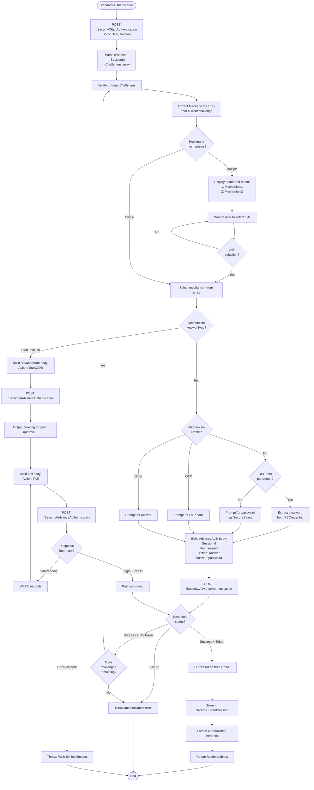
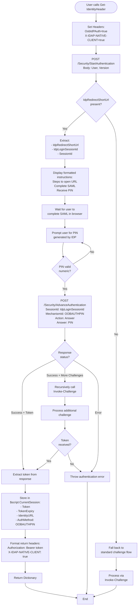
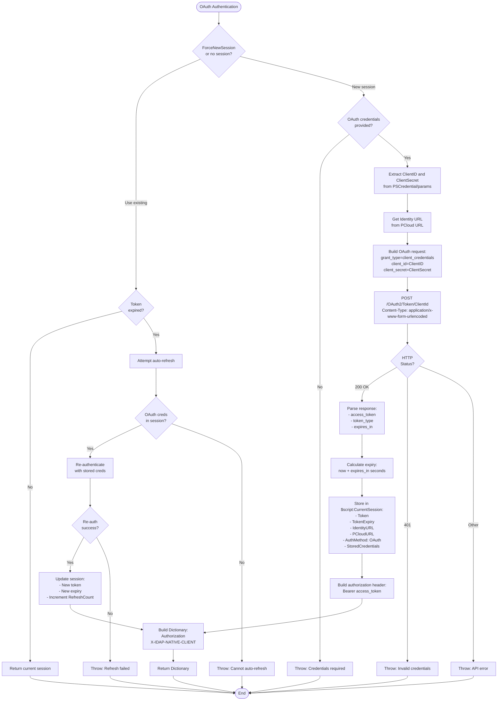
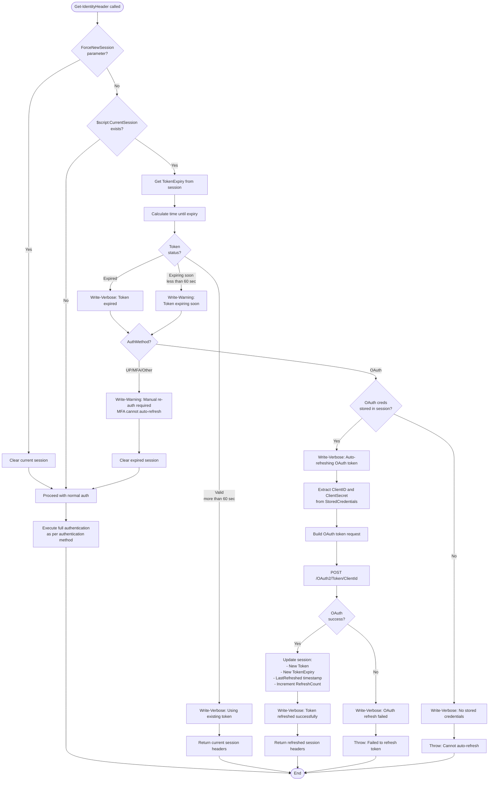
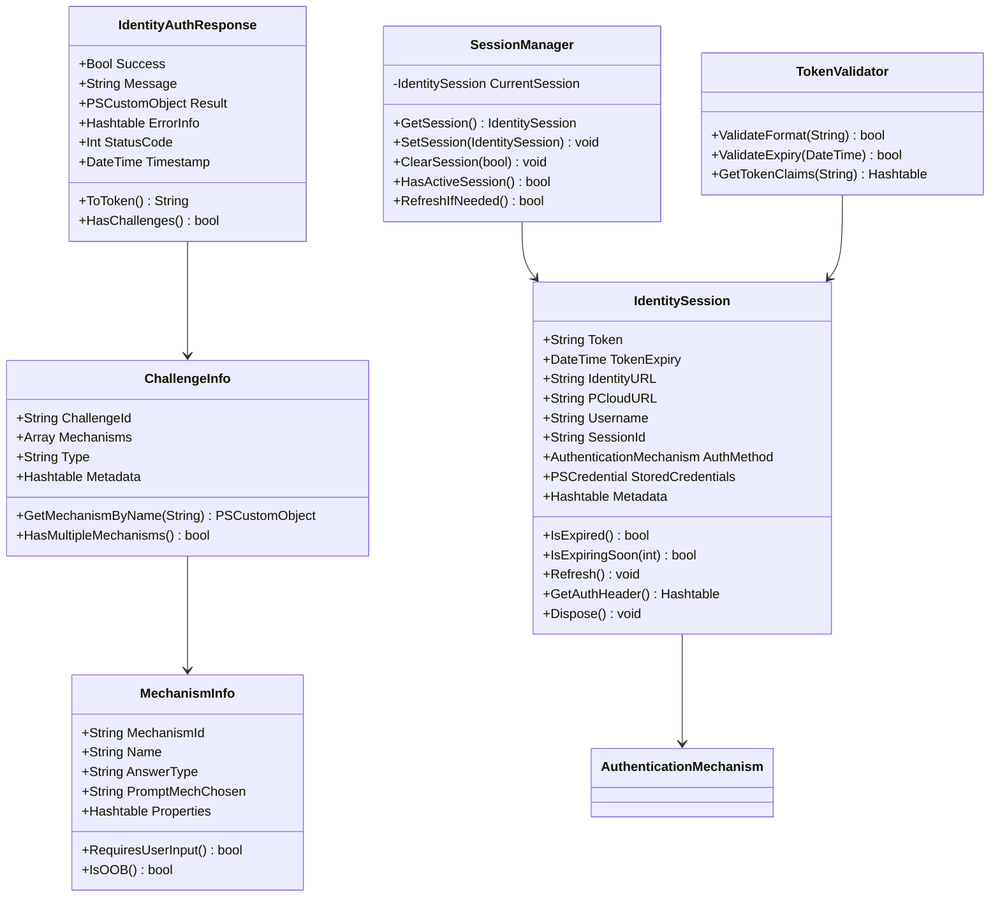
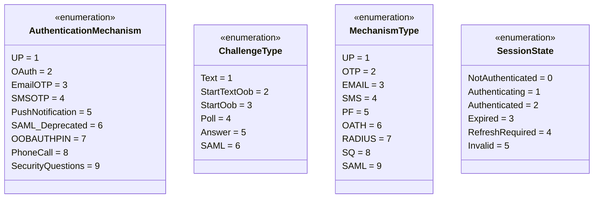
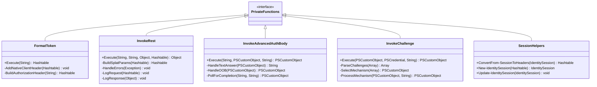
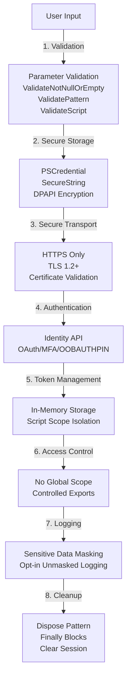
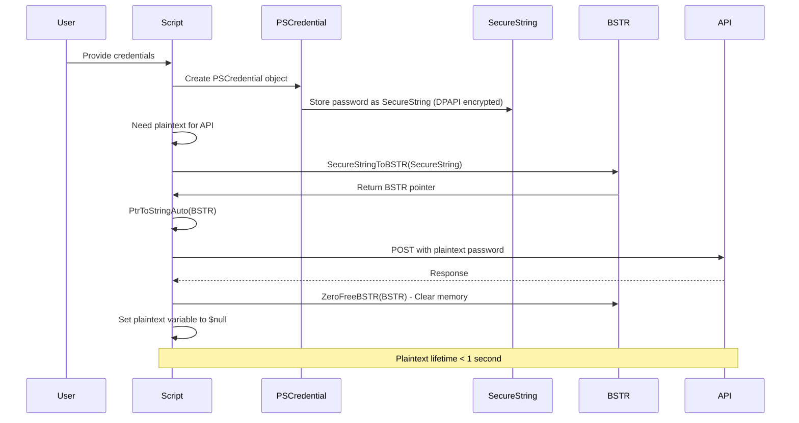

# Identity Authentication Module - Architecture Design

## Table of Contents
1. [Process Flow Diagrams](#process-flow-diagrams)
2. [Class Structure Diagrams](#class-structure-diagrams)
3. [Module Structure](#module-structure)
4. [Session State Management](#session-state-management)
5. [Return Value Structure](#return-value-structure)
6. [Security Architecture](#security-architecture)

---

## Process Flow Diagrams


### 1. Standard Challenge Flow (UP/OTP/Push)



### 2. OOBAUTHPIN Authentication Flow



### 3. OAuth Authentication Flow



### 4. Token Refresh Logic Flow



---

## Class Structure Diagrams

**Class Diagram Legend:**
- `+` = **Public** (accessible from outside the class)
- `-` = **Private** (only accessible within the class)
- `#` = **Protected** (accessible within class and subclasses)

### 1. Core Classes and Relationships (PowerShell 7)



### 2. Enum Definitions (PowerShell 7)



### 3. Private Function Organization



---

## Module Structure

### Public vs Private Functions

#### Public Functions (Exported to Users)

| Function | Purpose | Key Parameters | Returns |
|----------|---------|----------------|---------|
| `Get-IdentityHeader` | Main authentication entry point | IdentityUserName, UPCreds, OAuthCreds, PIN, ForceNewSession, IdentityTenantURL, PCloudURL | String (Bearer token) |
| `Get-IdentityURL` | Discover Identity URL from PCloud URL | PCloudURL | String (Identity URL) |
| `Test-IdentityToken` | Validate token validity and expiry | Token, IdentityURL | Boolean |
| `Clear-IdentitySession` | Clear current session and optionally logout | NoLogout (switch) | Void |
| `Get-IdentitySession` | Get current session details | None | IdentitySession or Hashtable |

#### Private Functions (Internal Use Only)

| Function | Purpose | Used By |
|----------|---------|---------|
| `Format-Token` | Extract and return Bearer token string | Get-IdentityHeader, token refresh logic |
| `Invoke-Rest` | Make REST API calls with splatting and logging | All API interactions |
| `Invoke-AdvancedAuthBody` | Handle AdvanceAuthentication API | Invoke-Challenge, OOBAUTHPIN flow |
| `Invoke-Challenge` | Process authentication challenges | Get-IdentityHeader (standard flow) |
| `Invoke-OOBAUTHPIN` | Handle OOBAUTHPIN (SAML + PIN) authentication | Get-IdentityHeader (OOBAUTHPIN flow) |
| `ConvertFrom-SessionToHeaders` | Convert session object to headers | Token refresh, existing session reuse |
| `New-IdentitySession` | Create new session object/hashtable | After successful authentication |
| `Update-IdentitySession` | Update session with refreshed token | OAuth token refresh |

### PowerShell 5.1 vs PowerShell 7 Feature Comparison

| Feature | PowerShell 5.1 | PowerShell 7+ | Implementation Strategy |
|---------|----------------|---------------|-------------------------|
| **Classes** | Supported (PS 5.0+) | Fully supported | Use in both, full feature in PS7 |
| **Enums** | Supported | Fully supported | Use in both versions |
| **Ternary Operator** | ❌ Not available | ✅ `$x ? $a : $b` | Use if/else in PS5.1, ternary in PS7 |
| **Null Coalescing** | ❌ Not available | ✅ `$x ?? $default` | Use explicit checks in PS5.1 |
| **Null Conditional** | ❌ Not available | ✅ `$obj?.Property` | Use explicit null checks in PS5.1 |
| **Pipeline Chain** | ❌ Not available | ✅ `cmd1 && cmd2` | Use separate statements in PS5.1 |
| **SecureString** | Fully supported (DPAPI) | Supported (less secure on non-Windows) | Use consistently, document limitations |
| **ForEach-Object -Parallel** | ❌ Not available | ✅ Available | Provide serial version for PS5.1 |
| **ConvertFrom-Json -AsHashtable** | ❌ Not available | ✅ Available (7.2+) | Manual conversion in PS5.1 |
| **Invoke-RestMethod Redirect** | `.BaseResponse.ResponseURI.Host` | `.BaseResponse.RequestMessage.RequestUri.Host` | Conditional logic based on `$PSVersionTable.PSVersion.Major` |
| **$IsWindows** | ❌ Not available | ✅ Available | Define `$IsWindows = $true` in PS5.1 |
| **Platform Support** | Windows only | Cross-platform | Use platform checks where needed |
| **Hashtable Creation** | Standard | Enhanced | Use standard syntax for compatibility |
| **Splatting** | ✅ Fully supported | ✅ Fully supported | Use extensively in both |


### Build Process: From Source to Distribution

**Goal:** Combine all separate .ps1 files into a single .psm1 for easy distribution.

**Build Script (`Build/Build-Module.ps1`):**
```powershell
<#
.SYNOPSIS
    Builds distribution-ready module files from source.

.DESCRIPTION
    Combines all .ps1 files from Private/, Public/, Classes/, Enums/ into single .psm1 files.
    Validates with PSScriptAnalyzer before building.

.EXAMPLE
    .\Build-Module.ps1 -Version PS5.1
    .\Build-Module.ps1 -Version PS7
    .\Build-Module.ps1 -Version All
#>
[CmdletBinding()]
param(
    [Parameter(Mandatory = $false)]
    [ValidateSet('PS5.1', 'PS7', 'All')]
    [string]$Version = 'All'
)

function Build-SingleModule {
    param(
        [string]$SourcePath,    # e.g., "PS5.1"
        [string]$ModuleName,    # e.g., "IdentityAuth"
        [string]$OutputPath     # e.g., "Distribution"
    )

    Write-Output "Building $ModuleName from $SourcePath..."

    # Validate source with PSScriptAnalyzer
    Write-Output "  Running PSScriptAnalyzer..."
    $analysisResults = Invoke-ScriptAnalyzer -Path $SourcePath -Recurse -Settings ../PSScriptAnalyzerSettings.psd1
    if ($analysisResults) {
        Write-Warning "PSScriptAnalyzer found issues. Fix before building!"
        $analysisResults | Format-Table -AutoSize
        return $false
    }

    # Create output directory
    $null = New-Item -Path $OutputPath -ItemType Directory -Force

    # Start building combined .psm1
    $combinedContent = @()

    # Add header
    $combinedContent += @"
<#
.SYNOPSIS
    $ModuleName - CyberArk Identity Authentication Module

.DESCRIPTION
    Authentication module for CyberArk Identity Security Platform Shared Services (ISPSS).
    Supports OAuth, UP, MFA, and OOBAUTHPIN authentication methods.

.NOTES
    Version:        2.0.0
    Generated:      $(Get-Date -Format 'yyyy-MM-dd HH:mm:ss')
    Build Process:  Combined from source files in $SourcePath/
#>

#Requires -Version $(if ($ModuleName -eq 'IdentityAuth') {'5.1'} else {'7.0'})

# Set strict mode
Set-StrictMode -Version Latest

# Module-level variables
`$script:CurrentSession = `$null

"@

    # For PS7, add Classes first
    if ($ModuleName -eq 'IdentityAuth7') {
        Write-Output "  Adding Classes..."
        $classFiles = Get-ChildItem -Path "$SourcePath/Classes/*.ps1" -File | Sort-Object Name
        foreach ($file in $classFiles) {
            $combinedContent += "`n# Region: Class - $($file.BaseName)"
            $combinedContent += Get-Content -Path $file.FullName -Raw
            $combinedContent += "# EndRegion: Class - $($file.BaseName)`n"
        }

        Write-Output "  Adding Enums..."
        $enumFiles = Get-ChildItem -Path "$SourcePath/Enums/*.ps1" -File | Sort-Object Name
        foreach ($file in $enumFiles) {
            $combinedContent += "`n# Region: Enum - $($file.BaseName)"
            $combinedContent += Get-Content -Path $file.FullName -Raw
            $combinedContent += "# EndRegion: Enum - $($file.BaseName)`n"
        }
    }

    # Add Private functions
    Write-Output "  Adding Private functions..."
    $privateFiles = Get-ChildItem -Path "$SourcePath/Private/*.ps1" -File | Sort-Object Name
    foreach ($file in $privateFiles) {
        $combinedContent += "`n# Region: Private - $($file.BaseName)"
        $combinedContent += Get-Content -Path $file.FullName -Raw
        $combinedContent += "# EndRegion: Private - $($file.BaseName)`n"
    }

    # Add Public functions
    Write-Output "  Adding Public functions..."
    $publicFiles = Get-ChildItem -Path "$SourcePath/Public/*.ps1" -File | Sort-Object Name
    foreach ($file in $publicFiles) {
        $combinedContent += "`n# Region: Public - $($file.BaseName)"
        $combinedContent += Get-Content -Path $file.FullName -Raw
        $combinedContent += "# EndRegion: Public - $($file.BaseName)`n"
    }

    # Add module exports footer
    $publicFunctionNames = $publicFiles.BaseName
    $combinedContent += @"

# Export public functions
Export-ModuleMember -Function @(
    $(($publicFunctionNames | ForEach-Object { "'$_'" }) -join ",`n    ")
)
"@

    # Write combined file
    $outputFile = Join-Path $OutputPath "$ModuleName.psm1"
    $combinedContent | Out-File -FilePath $outputFile -Encoding UTF8 -Force
    Write-Output "  Created: $outputFile"

    # Copy manifest
    Copy-Item -Path "$SourcePath/$ModuleName.psd1" -Destination "$OutputPath/$ModuleName.psd1" -Force
    Write-Output "  Copied: $ModuleName.psd1"

    # Test import
    Write-Output "  Testing import..."
    Import-Module $outputFile -Force -ErrorAction Stop
    Remove-Module $ModuleName -ErrorAction SilentlyContinue

    Write-Output "  SUCCESS: $ModuleName built successfully!`n"
    return $true
}

# Main build logic
$rootPath = Split-Path -Parent $PSScriptRoot
$distPath = Join-Path $rootPath "Distribution"

if ($Version -in 'PS5.1', 'All') {
    $success = Build-SingleModule -SourcePath (Join-Path $rootPath "PS5.1") -ModuleName "IdentityAuth" -OutputPath $distPath
    if (-not $success) { exit 1 }
}

if ($Version -in 'PS7', 'All') {
    $success = Build-SingleModule -SourcePath (Join-Path $rootPath "PS7") -ModuleName "IdentityAuth7" -OutputPath $distPath
    if (-not $success) { exit 1 }
}

# Copy README for end users
Copy-Item -Path (Join-Path $rootPath "README.md") -Destination (Join-Path $distPath "README.md") -Force

Write-Output "="*80
Write-Output "BUILD COMPLETE!"
Write-Output "Distribution files ready in: $distPath"
Write-Output "="*80
```

**VS Code Build Task (`.vscode/tasks.json`):**
```json
{
    "version": "2.0.0",
    "tasks": [
        {
            "label": "Build Module - All",
            "type": "shell",
            "command": "pwsh",
            "args": ["-File", "${workspaceFolder}/Build/Build-Module.ps1", "-Version", "All"],
            "group": {
                "kind": "build",
                "isDefault": true
            },
            "problemMatcher": []
        },
        {
            "label": "Build Module - PS5.1 Only",
            "type": "shell",
            "command": "pwsh",
            "args": ["-File", "${workspaceFolder}/Build/Build-Module.ps1", "-Version", "PS5.1"],
            "problemMatcher": []
        },
        {
            "label": "Build Module - PS7 Only",
            "type": "shell",
            "command": "pwsh",
            "args": ["-File", "${workspaceFolder}/Build/Build-Module.ps1", "-Version", "PS7"],
            "problemMatcher": []
        }
    ]
}
```

**Build Workflow:**
```
1. DEVELOP in PS5.1/ or PS7/ folders (organized .ps1 files)
   ↓
2. RUN PSScriptAnalyzer (zero violations required)
   ↓
3. RUN Build-Module.ps1 (combines into single .psm1)
   ↓
4. OUTPUT to Distribution/ folder
   ↓
5. TEST Distribution/IdentityAuth.psm1 import
   ↓
6. DELIVER Distribution/ files to end users
```

**Benefits:**
- ✅ **Dev**: Organized, maintainable source code
- ✅ **Build**: Automated, validated, repeatable process
- ✅ **Delivery**: Single .psm1 + .psd1 for easy import
- ✅ **VS Code**: Press `Ctrl+Shift+B` to build instantly

---

### Module Exports

**IdentityAuth.psd1 / IdentityAuth7.psd1:**
```powershell
@{
    ModuleVersion = '2.0.0'
    GUID = '12345678-1234-1234-1234-123456789012'  # Generate unique GUID
    Author = 'CyberArk'
    CompanyName = 'CyberArk'
    Copyright = '(c) 2026 CyberArk. All rights reserved.'
    Description = 'Authentication module for CyberArk Identity Security Platform Shared Services (ISPSS)'
    PowerShellVersion = '5.1'  # or '7.0' for IdentityAuth7.psd1

    FunctionsToExport = @(
        'Get-IdentityHeader',
        'Get-IdentityURL',
        'Test-IdentityToken',
        'Clear-IdentitySession',
        'Get-IdentitySession'
    )

    VariablesToExport = @()  # No variables exported
    AliasesToExport = @()    # No aliases

    PrivateData = @{
        PSData = @{
            Tags = @('CyberArk', 'Identity', 'Authentication', 'PrivilegeCloud', 'PAM', 'ISPSS')
            LicenseUri = 'https://github.com/cyberark/epv-api-scripts/blob/main/LICENSE'
            ProjectUri = 'https://github.com/cyberark/epv-api-scripts'
            ReleaseNotes = 'v2.0.0: Complete rewrite with OOBAUTHPIN support, OAuth modernization, PS7 classes/enums'
        }
    }
}
```

---

## Session State Management

### $script:CurrentSession Structure

#### PowerShell 7 Version (Class)

```powershell
class IdentitySession {
    # Core authentication data
    [string]$Token                          # Bearer token
    [datetime]$TokenExpiry                  # Calculated expiry timestamp
    [string]$IdentityURL                    # https://tenant.id.cyberark.cloud
    [string]$PCloudURL                      # https://subdomain.privilegecloud.cyberark.cloud/PasswordVault

    # User and session metadata
    [string]$Username                       # Authenticated username
    [string]$SessionId                      # Identity SessionId from StartAuthentication
    [AuthenticationMechanism]$AuthMethod    # Method used (OAuth, UP, OOBAUTHPIN, etc.)

    # Optional stored credentials (OAuth only for auto-refresh)
    [PSCredential]$StoredCredentials        # Securely stored OAuth credentials

    # Additional metadata
    [hashtable]$Metadata = @{
        CreatedAt = [datetime]::Now
        LastRefreshed = [datetime]::Now
        RefreshCount = 0
        PCloudVersion = $null
        TenantId = $null
    }

    # Constructor
    IdentitySession() { }

    IdentitySession([hashtable]$Properties) {
        $this.Token = $Properties.Token
        $this.TokenExpiry = $Properties.TokenExpiry
        $this.IdentityURL = $Properties.IdentityURL
        $this.PCloudURL = $Properties.PCloudURL ?? ''
        $this.Username = $Properties.Username
        $this.SessionId = $Properties.SessionId ?? ''
        $this.AuthMethod = $Properties.AuthMethod
        $this.StoredCredentials = $Properties.StoredCredentials
    }

    # Methods
    [bool] IsExpired() {
        return (Get-Date) -gt $this.TokenExpiry
    }

    [bool] IsExpiringSoon([int]$ThresholdSeconds = 60) {
        $expiryThreshold = (Get-Date).AddSeconds($ThresholdSeconds)
        return $this.TokenExpiry -lt $expiryThreshold
    }

    [void] Refresh() {
        if ($this.AuthMethod -eq [AuthenticationMechanism]::OAuth) {
            if ($null -ne $this.StoredCredentials) {
                Write-Verbose "Auto-refreshing OAuth token"

                $ClientId = $this.StoredCredentials.UserName
                $bstr = [System.Runtime.InteropServices.Marshal]::SecureStringToBSTR($this.StoredCredentials.Password)
                $ClientSecret = [System.Runtime.InteropServices.Marshal]::PtrToStringAuto($bstr)

                try {
                    $body = "grant_type=client_credentials&client_id=$ClientId&client_secret=$ClientSecret"
                    $oauthParams = @{
                        Uri = "$($this.IdentityURL)/OAuth2/Token/$ClientId"
                        Method = 'Post'
                        ContentType = 'application/x-www-form-urlencoded'
                        Body = $body
                        ErrorAction = 'Stop'
                    }
                    $response = Invoke-RestMethod @oauthParams

                    $this.Token = $response.access_token
                    $this.TokenExpiry = (Get-Date).AddSeconds($response.expires_in)
                    $this.Metadata.LastRefreshed = Get-Date
                    $this.Metadata.RefreshCount++

                    Write-Verbose "OAuth token refreshed successfully (Refresh count: $($this.Metadata.RefreshCount))"
                } catch {
                    throw "Failed to refresh OAuth token: $($_.Exception.Message)"
                } finally {
                    if ($bstr) {
                        [System.Runtime.InteropServices.Marshal]::ZeroFreeBSTR($bstr)
                    }
                    $ClientSecret = $null
                }
            } else {
                throw "Cannot refresh: OAuth credentials not stored in session"
            }
        } else {
            throw "Cannot auto-refresh: AuthMethod '$($this.AuthMethod)' requires manual user interaction"
        }
    }

    [hashtable] GetAuthHeader() {
        if ($this.IsExpired()) {
            throw "Token expired. Re-authentication required."
        }
        return @{
            'Authorization' = "Bearer $($this.Token)"
            'X-IDAP-NATIVE-CLIENT' = 'true'
        }
    }

    [void] Dispose() {
        Write-Verbose "Disposing Identity session for user: $($this.Username)"

        # Call logout endpoint
        try {
            $logoutUrl = "$($this.IdentityURL)/Security/logout"
            $logoutParams = @{
                Uri = $logoutUrl
                Method = 'Post'
                Headers = $this.GetAuthHeader()
                ErrorAction = 'SilentlyContinue'
            }
            Invoke-RestMethod @logoutParams | Out-Null
            Write-Verbose "Logout API call successful"
        } catch {
            Write-Verbose "Logout API call failed: $($_.Exception.Message)"
        }

        # Clear sensitive data
        $this.Token = $null
        $this.StoredCredentials = $null
        $this.SessionId = $null
        Write-Verbose "Session disposed"
    }
}

# Script-scope variable to store current session
$script:CurrentSession = $null
```

#### PowerShell 5.1 Version (Hashtable)

```powershell
# Script-scope hashtable to store current session
$script:CurrentSession = @{
    Token = $null
    TokenExpiry = $null
    IdentityURL = $null
    PCloudURL = $null
    Username = $null
    SessionId = $null
    AuthMethod = $null
    StoredCredentials = $null
    Metadata = @{
        CreatedAt = $null
        LastRefreshed = $null
        RefreshCount = 0
        PCloudVersion = $null
        TenantId = $null
    }
}

# Helper functions to mimic class methods
function Test-SessionExpired {
    param([hashtable]$Session)
    return (Get-Date) -gt $Session.TokenExpiry
}

function Test-SessionExpiringSoon {
    param(
        [hashtable]$Session,
        [int]$ThresholdSeconds = 60
    )
    $expiryThreshold = (Get-Date).AddSeconds($ThresholdSeconds)
    return $Session.TokenExpiry -lt $expiryThreshold
}

function Update-IdentitySession {
    param([hashtable]$Session)

    if ($Session.AuthMethod -eq 'OAuth') {
        if ($null -ne $Session.StoredCredentials) {
            # Same OAuth refresh logic as PS7 class method
            # ... implementation ...
        } else {
            throw "Cannot refresh: OAuth credentials not stored"
        }
    } else {
        throw "Cannot auto-refresh: Manual re-authentication required"
    }
}

function Get-SessionAuthHeader {
    param([hashtable]$Session)

    if (Test-SessionExpired -Session $Session) {
        throw "Token expired. Re-authentication required."
    }
    return @{
        'Authorization' = "Bearer $($Session.Token)"
        'X-IDAP-NATIVE-CLIENT' = 'true'
    }
}

function Remove-IdentitySessionData {
    param([hashtable]$Session)

    Write-Verbose "Disposing Identity session for user: $($Session.Username)"

    # Call logout endpoint
    try {
        $logoutUrl = "$($Session.IdentityURL)/Security/logout"
        $logoutParams = @{
            Uri = $logoutUrl
            Method = 'Post'
            Headers = (Get-SessionAuthHeader -Session $Session)
            ErrorAction = 'SilentlyContinue'
        }
        Invoke-RestMethod @logoutParams | Out-Null
        Write-Verbose "Logout API call successful"
    } catch {
        Write-Verbose "Logout API call failed: $($_.Exception.Message)"
    }

    # Clear sensitive data
    $Session.Token = $null
    $Session.StoredCredentials = $null
    $Session.SessionId = $null
    Write-Verbose "Session disposed"
}
```

### Session Security Considerations

#### Token Storage
- **In-Memory Only**: Tokens stored only in `$script:CurrentSession`, never written to disk
- **Process Isolation**: PowerShell process memory isolated from other processes
- **Automatic Cleanup**: `Dispose()` method/function clears sensitive data
- **No Global Scope**: Session not exported to global scope, preventing accidental exposure

#### Credential Storage (OAuth Only)
- **PSCredential Object**: Uses SecureString for password portion
- **Windows DPAPI**: SecureString encrypted with user's Windows credentials (PS 5.1/Windows)
- **Limited Exposure**: Only stored when necessary for auto-refresh
- **User Control**: Can be disabled via parameters

#### Session Lifetime
- **Token Expiry**: Strictly enforced, no usage after expiry
- **Auto-Refresh**: Only for OAuth with stored credentials
- **Manual Re-auth**: Required for MFA-based authentication
- **Session Timeout**: Follows Identity platform timeout policies

---

## Return Value Structure

### Get-IdentityHeader Return Value

**Type:** `System.Collections.Hashtable`

**Structure:** Hashtable with authorization headers

**Example:**
```powershell
$headers = Get-IdentityHeader -OAuthCreds $creds -PCloudURL 'https://subdomain.privilegecloud.cyberark.cloud/PasswordVault'
# Returns:
# Name                           Value
# ----                           -----
# X-IDAP-NATIVE-CLIENT           true
# Authorization                  Bearer eyJhbGciOiJSUzI1NiIsInR5cCI6IkpXVCIsImtpZCI6...
```

**Usage Example:**
```powershell
# Get headers
$headers = Get-IdentityHeader -OAuthCreds $creds -PCloudURL 'https://subdomain.privilegecloud.cyberark.cloud/PasswordVault'

# Use with Accounts_Onboard_Utility.ps1
.\Accounts_Onboard_Utility.ps1 -PVWAURL 'https://subdomain.privilegecloud.cyberark.cloud/PasswordVault' -logonToken $headers

# Use with any Privilege Cloud API
$accountsUrl = 'https://subdomain.privilegecloud.cyberark.cloud/PasswordVault/PasswordVault/API/Accounts'
$accounts = Invoke-RestMethod -Uri $accountsUrl -Method Get -Headers $headers
```

**Hashtable Contents:**
```powershell
@{
    'Authorization'        = 'Bearer eyJhbGciOiJSUzI1NiIsInR5cCI6IkpXVCIsImtpZCI6...'
    'X-IDAP-NATIVE-CLIENT' = 'true'
}
```

### Compatibility with Accounts_Onboard_Utility.ps1

The Accounts_Onboard_Utility.ps1 script accepts the hashtable returned by `Get-IdentityHeader`:

```powershell
$headers = Get-IdentityHeader -OAuthCreds $creds -PCloudURL 'https://subdomain.privilegecloud.cyberark.cloud/PasswordVault'
$pvwaUrl = 'https://subdomain.privilegecloud.cyberark.cloud/PasswordVault'

# Pass the hashtable to -logonToken
.\Accounts_Onboard_Utility.ps1 -PVWAURL $pvwaUrl -logonToken $headers
```

**All epv-api-scripts that use `-logonToken` accept the hashtable format.**

**Note:** This format is specifically for **Privilege Cloud (PCloud)** which uses Bearer tokens. On-premises PVWA installations use session tokens from CyberArk Authentication, not Identity authentication.

---

## Security Architecture

### Defense in Depth Layers



### Threat Model and Mitigations

| Threat | Impact | Mitigation | Implementation |
|--------|--------|-----------|----------------|
| **Credential Exposure in Memory** | High | Use SecureString, minimize plaintext lifetime | PSCredential objects, BSTR only when needed, ZeroFreeBSTR in finally |
| **Token Interception (MITM)** | High | HTTPS only, TLS 1.2+ | `[Net.ServicePointManager]::SecurityProtocol = [Net.SecurityProtocolType]::Tls12` |
| **Token Theft from Memory** | High | In-memory only, script scope, auto-cleanup | `$script:CurrentSession`, Dispose() method, no disk writes |
| **Log File Exposure** | Medium | Sensitive data masking, file permissions | Mask passwords/tokens/secrets in logs, document secure log storage |
| **Replay Attacks** | Medium | Token expiry, session validation | Strict expiry enforcement, IsExpired() checks |
| **Man-in-Middle** | High | Certificate validation | Enabled by default, disable only for testing with warning |
| **Privilege Escalation** | Medium | Least privilege tokens | OAuth scopes, Identity RBAC policies |
| **Session Hijacking** | Medium | SessionId validation, timeout | Track SessionId, enforce platform timeouts |
| **Password in Command History** | Medium | Use PSCredential, avoid plain text params | Prefer PSCredential, SecureString over plain strings |
| **Cross-Script Token Leakage** | Low | Script scope isolation | No global scope, controlled exports |

### Secure Credential Handling Workflow



---

## API Integration

### Identity API Endpoints Used

| Endpoint | Method | Purpose | Request Body | Response | Auth Required |
|----------|--------|---------|--------------|----------|---------------|
| `/oauth2/platformtoken/` or `/OAuth2/Token/ClientId` | POST | OAuth token generation | grant_type, client_id, client_secret (form-urlencoded) | access_token, token_type, expires_in | No (uses client creds) |
| `/Security/StartAuthentication` | POST | Initiate authentication session | User, Version (JSON) | SessionId, Challenges, IdpRedirectShortUrl (if OOBAUTHPIN), TenantId | No |
| `/Security/AdvanceAuthentication` | POST | Answer challenge/submit PIN | SessionId, MechanismId, Action, Answer (JSON) | Success, Token, Summary | No |
| `/Security/logout` | POST | End session | None | Success message | Yes (Bearer token) |

### API Request/Response Examples

#### OAuth Token Request

**Request:**
```http
POST /OAuth2/Token/myClientId HTTP/1.1
Host: tenant.id.cyberark.cloud
Content-Type: application/x-www-form-urlencoded

grant_type=client_credentials&client_id=myClientId&client_secret=myClientSecret
```

**Response (Success):**
```json
{
  "access_token": "eyJ0eXAiOiJKV1QiLCJhbGciOiJSUzI1NiIsIng1dCI6...",
  "token_type": "Bearer",
  "expires_in": 3600
}
```

**Response (Error - 401):**
```json
{
  "error": "invalid_client",
  "error_description": "Client authentication failed"
}
```

#### StartAuthentication Request (OOBAUTHPIN)

**Request:**
```http
POST /Security/StartAuthentication HTTP/1.1
Host: tenant.id.cyberark.cloud
Content-Type: application/json
X-IDAP-NATIVE-CLIENT: true
OobIdPAuth: true

{
  "User": "admin@company.com",
  "Version": "1.0"
}
```

**Response (OOBAUTHPIN Available):**
```json
{
  "success": true,
  "Result": {
    "SessionId": "abc123...",
    "TenantId": "tenant123",
    "IdpRedirectShortUrl": "https://short.cyberark.cloud/abc123",
    "IdpLoginSessionId": "saml-session-xyz789"
  }
}
```

**Response (Standard Challenges):**
```json
{
  "success": true,
  "Result": {
    "SessionId": "abc123...",
    "TenantId": "tenant123",
    "Challenges": [
      {
        "Mechanisms": [
          {
            "MechanismId": "mech123",
            "Name": "UP",
            "AnswerType": "Text",
            "PromptMechChosen": "Password"
          },
          {
            "MechanismId": "mech456",
            "Name": "PF",
            "AnswerType": "StartTextOob",
            "PromptMechChosen": "Push to mobile"
          }
        ]
      }
    ]
  }
}
```

#### AdvanceAuthentication Request (OOBAUTHPIN)

**Request:**
```http
POST /Security/AdvanceAuthentication HTTP/1.1
Host: tenant.id.cyberark.cloud
Content-Type: application/json
X-IDAP-NATIVE-CLIENT: true

{
  "SessionId": "saml-session-xyz789",
  "MechanismId": "OOBAUTHPIN",
  "Action": "Answer",
  "Answer": "123456"
}
```

**Response (Success with Token):**
```json
{
  "success": true,
  "Result": {
    "Summary": "LoginSuccess",
    "Token": "eyJ0eXAiOiJKV1QiLCJhbGciOiJSUzI1NiIsIng1dCI6...",
    "UserId": "user123",
    "User": "admin@company.com"
  }
}
```

**Response (Success with More Challenges):**
```json
{
  "success": true,
  "Result": {
    "Summary": "NewPackage",
    "SessionId": "abc123...",
    "Challenges": [
      {
        "Mechanisms": [
          {
            "MechanismId": "mech789",
            "Name": "OTP",
            "AnswerType": "Text",
            "PromptMechChosen": "Enter OTP code"
          }
        ]
      }
    ]
  }
}
```

### Error Handling Patterns

```powershell
function Invoke-IdentityAPI {
    param(
        [string]$Uri,
        [string]$Method,
        [object]$Body,
        [hashtable]$Headers
    )

    try {
        $invokeParams = @{
            Uri = $Uri
            Method = $Method
            ErrorAction = 'Stop'
        }

        if ($Body) {
            $invokeParams.Body = $Body
            $invokeParams.ContentType = 'application/json'
        }

        if ($Headers) {
            $invokeParams.Headers = $Headers
        }

        Write-Verbose "API Call: $Method $Uri"
        $response = Invoke-RestMethod @invokeParams
        Write-Verbose "API Response: Success"

        return $response

    } catch {
        $statusCode = $null
        $errorMessage = $_.Exception.Message

        if ($_.Exception.Response) {
            $statusCode = $_.Exception.Response.StatusCode.value__
        }

        # Parse error details
        $errorDetails = $null
        if ($_.ErrorDetails.Message) {
            try {
                $errorDetails = $_.ErrorDetails.Message | ConvertFrom-Json
            } catch {
                $errorDetails = $_.ErrorDetails.Message
            }
        }

        # Map HTTP status codes to meaningful errors
        $mappedError = switch ($statusCode) {
            401 { "Authentication failed: Invalid credentials or token expired" }
            403 { "Access denied: Insufficient permissions" }
            404 { "Endpoint not found: Check URL and API version" }
            429 { "Rate limit exceeded: Wait and retry" }
            500 { "Server error: $($errorDetails.message ?? $errorMessage)" }
            503 { "Service unavailable: Identity platform may be down" }
            default { "API error ($statusCode): $($errorDetails.message ?? $errorMessage)" }
        }

        Write-Verbose "API Error: $mappedError"

        $errorRecord = [System.Management.Automation.ErrorRecord]::new(
            [System.Exception]::new($mappedError),
            "IdentityAPI_$statusCode",
            [System.Management.Automation.ErrorCategory]::InvalidOperation,
            $Uri
        )
        $PSCmdlet.ThrowTerminatingError($errorRecord)
    }
}
```

---

## Conclusion

This architecture design provides comprehensive technical specifications for the modernized Identity Authentication module. The detailed process flows, class structures, and API integration patterns ensure clear understanding of the system's behavior.

Key architectural decisions:
1. **Dual Module Approach**: Separate PS5.1 and PS7 modules for maximum compatibility and feature utilization
2. **Session State Management**: Centralized `$script:CurrentSession` with automatic OAuth refresh
3. **Security First**: Defense in depth, secure credential handling, sensitive data masking
4. **Standards Compliance**: Zero PSScriptAnalyzer violations, extensive splatting, proper error handling
5. **User Experience**: Single-step authentication, clear instructions, helpful error messages

The architecture supports enterprise requirements while remaining accessible to administrators and developers. The clear separation between public and private functions, along with detailed type definitions, provides a solid foundation for implementation and future enhancements.
